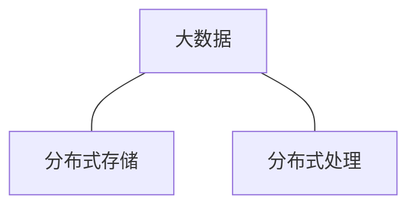

---

title: Hadoop大数据系统
date: 2020-02-18 14:30:00
tags: Hadoop大数据
---

大数据在2010年以后越来越火，大数据、物联网、云计算，这几个名词越来越多的出现在我们耳边···

<!-- more -->

# 第一讲-大数据概述


## 1.1大数据时代

大数据、云计算、物联网，促成第三次信息化浪潮。

| 信息化浪潮 | 发生时间   | 标志                   | 解决问题     |
| ---------- | ---------- | ---------------------- | ------------ |
| 第一次浪潮 | 1980年前后 | 个人计算机             | 信息处理     |
| 第二次浪潮 | 1995年前后 | 互联网                 | 信息传输     |
| 第三次浪潮 | 2010年前后 | 物联网、云计算、大数据 | **信息爆炸** |

- 大数据时代

  ```mermaid
  graph LR
  技术支撑---存储-容量升价格降
  技术支撑---计算-越来越快
  技术支撑---网络-越来越快
  ```

- 数据产生的方式现阶段：感知设备的普及


## 1.2大数据概念和影响

- 大数据时代的4V：
  - Volume（大量化）
  - Velocity（快速化）
  - Variety（多样化）
  - Value（价值密度低）

- 大数据大部分都是非结构化数据
- 大数据影响：
  - 全样而非抽样
  - 效率而非精确
  - 相关而非因果

## 1.3大数据的应用

- 影视投拍
- 谷歌预测流感

## 1.4大数据关键技术

1. 数据采集层
2. **数据存储与管理**
3. **数据处理与分析**
4. 数据隐私与安全

大数据两大核心技术：



- 大数据技术以谷歌公司技术为代表
  - 分布式数据库Big Table
  - 分布式文件系统GFS
  - 分布式并行处理技术MapReduce
- 不同的计算模式需要使用不同的产品
  - 批处理
    - MapReduce
    - Spark 可以迭代计算，数据挖掘等
  - 实时计算
    - 流计算
    - 图计算
  - 交互式处理
    - 查询计算

| 大数据计算模式 | 解决问题                       | 代表产品                                      |
| -------------- | ------------------------------ | --------------------------------------------- |
| 批处理技术     | 针对大规模数据的批处理         | MapReduce、Spark等                            |
| 流计算         | 针对流数据的实时计算           | Storm、S4、Flume、Streams、银河流数据处理平台 |
| 图计算         | 针对大规模图结构数据的处理     | Pregel、GraphX等                              |
| 查询分析计算   | 大规模数据的存储管理和查询分析 | Dremel、Hive、Cassandra、Impala等             |

## 1.5.1云计算

- 云计算典型特征：`虚拟化`、`多租户`

- 云计算概念：云计算是通过网络以服务的方式为用户提供非常了廉价的IT资源。

- 云计算有：公有云、私有云、混合云

- 三种云服务

  - IaaS 面向网络架构师
    - 将基础设施作为服务出租
  - PaaS 面向应用开发者
    - 平台即服务
  - SaaS 面向用户
    - 软件即服务

  

  ```mermaid
  graph BT
  IaaS-->PaaS
  PaaS-->SaaS
  ```

  

## 1.5.2物联网

- 物联网（IoT）The Internet of Things物物相连。

- 分层：

  - 应用层
  - 处理层
  - 网络层
  - 感知层

- ```mermaid
  graph LR
  物联网的关键技术---识别技术
  物联网的关键技术---感知技术
  ```

- ```mermaid
  graph LR
  感知-->传输
  传输-->存储
  ```

- 大数据、云计算、物联网相伴相生密不可分。

# 第二章-大数据处理架构Hadoop

## Hadoop的安装与使用

- Linux相关知识
  - shell：命令解析器
  - sudo命令：linux下获得root权限操作
  - 输入密码：不显示的
  - 切换中英文：用shift切换
  - 复制快捷键：<kbd>ctrl</kbd>+<kbd>shift</kbd>+<kbd>c</kbd>
- Hadoop安装方式
  - 单机模式
  - 伪分布式
  - 分布式
- 安装Linux
  - 双系统
  - 虚拟机
- Linux中安装Hadoop
  1. 创建hadoop用户
  2. SSH登陆权限设置
  3. 安装Java环境
  4. 单机安装配置
  5. 伪分布式安装配置
- 

