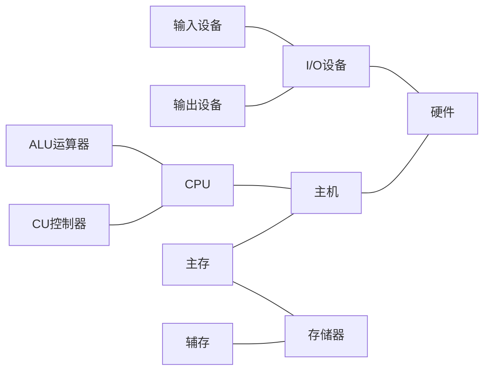

计算机组成原理是计算机专业的核心课程也是基础课程，每个学习计算机的人都会学习该课程。计算机考研不管是自主命题还是国家统一命题，都会涉及到计算机组成原理的题目。
<!-- more -->

## 1.1计算机系统简介
- 现在的计算机几乎都是`数字电子计算机`
- 计算机组成的一般原理，不以具体机型为依托
- 采用自顶向下的方式，层层细化。
- 计算机系统
    - 硬件 计算机的实体，如主机，外设。
    - 软件 由具有各类特殊功能的信息（程序）组成
        - 系统软件 用来管理整个计算机系统
            - 语言处理程序
            - **操作系统**
            - 服务性程序 如：数学库
            - 数据库管理系统
            - 网络软件
        - 应用软件 按照任务需要编制成的各种程序，如游戏等
- 硬件为软件提供接口 如指令集。
- **抽象**是应对系统复杂性的一个重要方法。
- 能直接让计算机接受的语言是**机器语言**

>计算机体系结构和计算机组成的不同

|分类|不同|例子|
|---|:---:|---:|
|计算机体系结构|程序员所见到的计算机系统的属性概念性的结构与功能特性（指指令系统，数据类型、寻址技术、I/O机理）**考虑可不可以实现**|有没有乘法指令|
|计算机组成|实现计算机体系结构所体现的属性（具体指令的实现）**考虑如何实现**|如何实现乘法指令|

## 1.2计算机的基本组成
- 最早提出“存储程序”概念的是`冯诺伊曼`
- `冯诺伊曼计算机`的特点
    - 计算机由五大部件组成
        - 运算器
        - 控制器
        - 存储器
        - 输入设备
        - 输出设备
    - 指令和数据以同等地位存于存储器可按地址寻访
    - 指令和数据都是`二进制`数表示
    - 指令由`操作码`和`地址码`组成
    - **存储程序** 核心特征
    - 以`运算器`为中心
- `冯诺伊曼机`工作方式的基本特点是`按地址访问并顺序执行指令`
- 存在缺陷
    1. `冯诺伊曼结构`以运算器为中心，导致运算器成为瓶颈。
    2. 不具有层次化特征。
- 以`存储器`为中心的计算机硬件框图
- 现代计算机硬件框图

- 计算机的算数逻辑单元和控制单元合成为`CPU`
- 系统复杂性管理的方法2（3Y）
    - 层次化：将被设计的系统划分成多和模块或子模块
    - 模块化：有明确定义的功能和接口
    - 规则化：采用一定的相同规则，模块更容易被重用