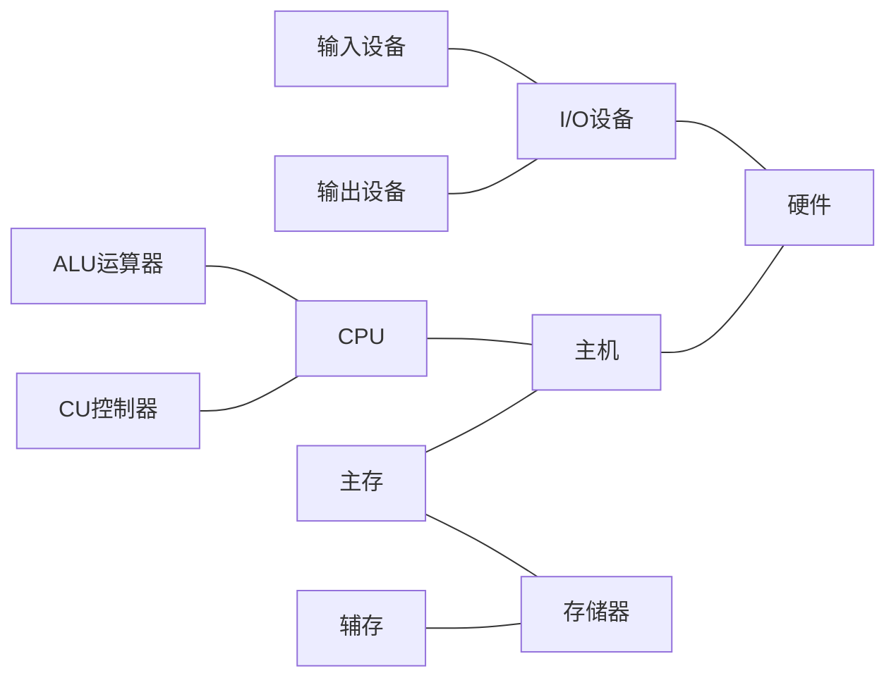

计算机组成原理是计算机专业的核心课程也是基础课程，每个学习计算机的人都会学习该课程。计算机考研不管是自主命题还是国家统一命题，都会涉及到计算机组成原理的题目。
<!-- more -->

[TOC]

# 第一章-计算机系统概论

## 考纲内容

1. 计算机发展历程
2. 计算机系统层次结构（计算机硬件的基本组成、计算机软件的分类、计算机的工作过程）
3. 计算机性能指标（吞吐量、响应时间、CPU时钟周期、主频、CPI、CPU执行时间、MIPS、MFLOPS、GFLOPS、TFLOPS）

## 1.1计算机系统简介

- 现在的计算机几乎都是`数字电子计算机`
- 计算机组成的一般原理，不以具体机型为依托
- 采用自顶向下的方式，层层细化。
- 计算机系统
    - 硬件 计算机的实体，如主机，外设。
    - 软件 由具有各类特殊功能的信息（程序）组成
        - 系统软件 用来管理整个计算机系统
            - 语言处理程序
            - **操作系统**
            - 服务性程序 如：数学库
            - 数据库管理系统
            - 网络软件
        - 应用软件 按照任务需要编制成的各种程序，如游戏等，在系统软件之上运行。
- 硬件为软件提供接口 如指令集。
- **抽象**是应对系统复杂性的一个重要方法。
- 能直接让计算机接受的语言是**机器语言**

>计算机体系结构和计算机组成的不同

|分类|不同|例子|
|---|:---:|---:|
|计算机体系结构|程序员所见到的计算机系统的属性概念性的结构与功能特性（指指令系统，数据类型、寻址技术、I/O机理）**考虑可不可以实现**|有没有乘法指令|
|计算机组成|实现计算机体系结构所体现的属性（具体指令的实现）**考虑如何实现**|如何实现乘法指令|

## 1.2计算机的基本组成
- 最早提出“存储程序”概念的是`冯诺伊曼`
- `冯诺伊曼计算机`的特点
    - 计算机由五大部件组成
        - 运算器
        - 控制器
        - 存储器
        - 输入设备
        - 输出设备
    - 指令和数据以同等地位存于存储器可按地址寻访
        - 高效率实现指令和数据的存储和运行
    - 指令和数据都是`二进制`数表示
        - 计算机可以不采用二进制运算，二进制适合用于计算机。
    - 指令由`操作码`和`地址码`组成
        - 指令是计算机进行功能实现的基本单位
        - 操作码 是这个指令是干什么的
        - 地址码是对哪几个数做什么运算
    - **存储程序** 核心特征
        - 预先把程序存到存储器中，用的时候直接用
    - 以`运算器`为中心
- `冯诺伊曼机`工作方式的基本特点是`按地址访问并顺序执行指令`
- 存在缺陷
    1. `冯诺伊曼结构`以运算器为中心，导致运算器成为瓶颈。
    2. 不具有层次化特征。
- 以`存储器`为中心的计算机硬件框图
- 现代计算机硬件框图

- 计算机的算数逻辑单元和控制单元合成为`CPU`
- 系统复杂性管理的方法2（3Y）
    - 层次化：将被设计的系统划分成多和模块或子模块
    - 模块化：有明确定义的功能和接口
    - 规则化：采用一定的相同规则，模块更容易被重用

问题：一个现实中的问题，如何用计算机来解决？（有些问题可以计算机解决，有些不行）

答：计算机中解决问题都是数据运算的，把问题数值化。

问题：是不是所有的问题都可以用计算机解决？

答：不是

- 计算机工作步骤
  1. 上机前的准备
     - 建立数学模型 u=U Sin w t

     - 确定计算方法

     - 编解题程序
       - 程序——运算的**全部步骤**
       - 指令——每一个步骤
         - 指令的格式，包括**操作码**和**地址码**
       
     - 指令和数据都是二进制，以同等地位保存在存储器中。

     - 存储器的基本组成

       ——————————

       ｜         存储体            ｜

       ｜    MAR       MDR     ｜

       ——————————

       - 存储体存放01数据-有若干个存储单元（是一个电子设备）-存储元件（0/1）
       - 存储单元  存放一串二进制代码 （按照地址寻访）
       - 存储字  存储单元中二进制代码的组合
       - 存储字长 存储单元中二进制代码的位数 每个存储单元赋予一个地址。一个存储单元中存放着一个存储字
       - MAR：就是一个寄存器 存储器地址寄存器 反应存储单元的个数
       - MDR：要送入到cpu的数据或者要保存到存储体的数据或者刚从存储体中取出来的数据  寄存器的长度和存储单元的长度是相同的。存储器数据寄存器反应存储字长。
       - 设一个存储器的MAR=4位 MDR=8位 则存储单元的个数16（从0000到1111） 存储字长8
  
  64bit
  
  1）8words*8bit(1Byte) 八个八位的字
  
  2) 4words*16bit(2Byte) 四个十六位的字
  
- 控制器的基本组成

  - 完成一条指令：
    - 取指令 PC ：存放当前欲执行指令的地址，具有技术功能（PC）+1 --->pc
    - 分析指令 IR
    - 执行指令 CU

## 1.3计算机硬件的主要技术指标

1. 机器字长：CPU一次能处理数据的位数，与CPU中的**寄存器位数**有关。64位指CPU一次处理位数

   32位的机器可以处理64位或者128位的数据处理。

2. 运算速度

   1. 主频
   2. 核数
   3. 吉普森法
   4. CPI
   5. MIPS
   6. FLOPS

3. 存储容量

   1. 主存容量
      - 存储单元个数✖️存储字长
        - 如MAR MDR 容量
        - ​    10     8               1k*8位
        - ​    16     32             64k*32位
      - 字节数
        - 如 2^13b=1 kb
        -  2^21b=256 kb
   2. 辅存容量
      - 字节数

# 第二章-计算机的发展及应用

## 考纲内容

## 2.1计算机的发展历史

1. 世界上第一台计算机
2. Moore定律 微芯片上集成的晶体管数目每三年翻两番
3. 软件的兴起和发展
   1. 各种语言
      - 机器语言 面向机器
      - 汇编语言 面向机器
      - 高级语言 面向问题
        - FORTRAN 科学计算和工程计算
        - PASCAL 结构化程序设计
        - C++ 面向对象
        - Java 适应网络环境
        - Python
   2. 系统软件
      - 语言处理程序 汇编语言 编译程序 解释程序
      - 操作系统：DOS、UNIX、Windows、Linux、MacOS等
      - 服务型程序 装配、调试、诊断、排错
      - 数据库管理系统 数据库和数据库管理软件
      - 网络软件
   3. 软件开发特点：
      1. 开发周期长
      2. 制作成本昂贵
      3. 检测软件产品质量的特殊性

## 2.2计算机的应用

1. 科学计算和数据处理
2. 工业控制和实时控制
3. 网络技术
   1. 电子商务
   2. 网络教育
   3. 敏捷制造
4. 虚拟现实
5. 办公自动化（OA）和管理信息系统
6. CAD/CAM/CIMS
7. 多媒体技术
8. 人工智能

## 2.3计算机的展望

1. 计算机具有类似人脑的一些超级智能功能 速度要快
2. 芯片集成度的提高受以下三方面限制
   - 芯片集成度受物理极限的制约
   - 按几何级数递增的制作成本
   - 芯片的功耗、散热、线延迟
3. 替代传统的硅芯片
   1. 光计算机
   2. DNA计算机
   3. 量子计算机

